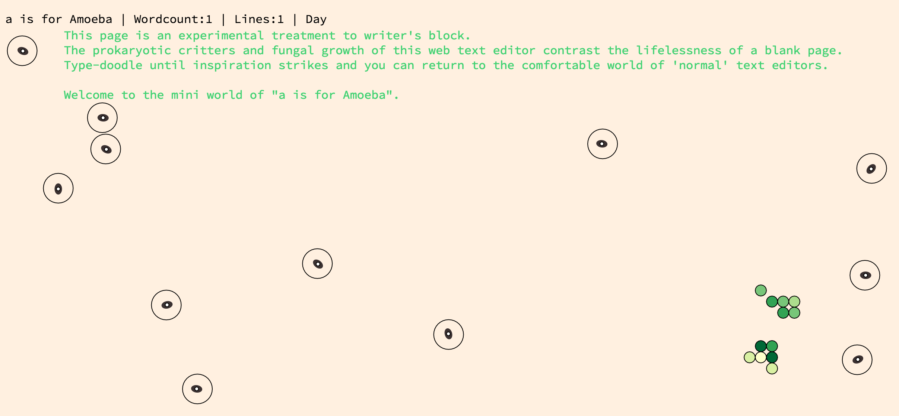

## A is for Amoeba ##

is a fun, web-based, novelty, text editor that wants to help you write creatively _or whatever_;
whether it's code, fiction, or a dream diary of our collective unconscious, I guarantee you won't
be able to concentrate with the dreamy amoebas floating about your screen. Is it annoying, hypnotic,
calming, what were you doing again? It's ok, don't worry. When you are in the world of the amoeba you never have to worry...would you like to visit the [World of Amoebas][edit]?

[][edit]

[edit]: http://jzwood.github.io/Amoeba-Edit/

### about AiFA + Easter eggs ###

So **A is for Amoeba** has a few interesting features. A single day in **AiFA** lasts only 60 minutes so every hour on the hour the world transforms from light to dark or vise versa. Mold is always trying to conquer the peaceful land and prevent you from seeing what you're typing but luckily Amoebas are always hungry and eat this mold when they pass through it. In **AiFA** even the typography is alive and _mellifluous_-- it will change its color to match any color you type (unless you're into taupe).

Also, this might be hard to believe...but amoebas' metabolic state is directly proprtional to sonic input...so if you're noisy they'll move more.

signing off with a cat face

\>^.^<
